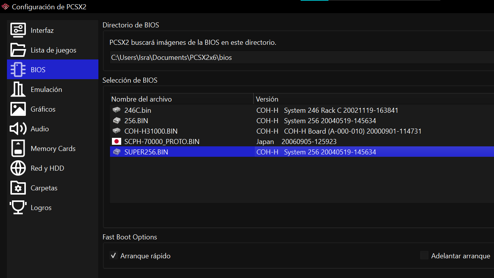

# Getting a bios

Dump your system2x6 bios using a hacked dongle or an SD2PSX/PSXMemCard or whatever method you have for running elf files from your system2x6

run this modified version of [biosdrain](https://github.com/PS2Homebrew-arcade/biosdrain/releases) from an USB in FAT32/EXFAT or from the SDCard of your SD2PSX/PSXMemCard and you're good to go!

## making sure it's the correct BIOS

as you probably guessed, SYSTEM246/SYSTEM256 do not use the same bios than retail PlayStation2's

you will need an arcade bios, otherwise games will **NOT** work due to a plethora of API differences on BIOS modules like `FILEIO`, `MCMAN`, `SIO2MAN` and more

fortunately for you, the program automatically identifies the appropiate bios, and it may even identify which system2x6 variant it comes from

here you have an example

you probably noticed it, but just to be sure:

arcade bios will be identified with the word `COH-H`, which is the model number prefix for arcade PlayStation2 units

for SYSTEM246, you may pick whatever system246 bios or system256 bios you want. however, for system256 games we recommend you stick to the 256 bios