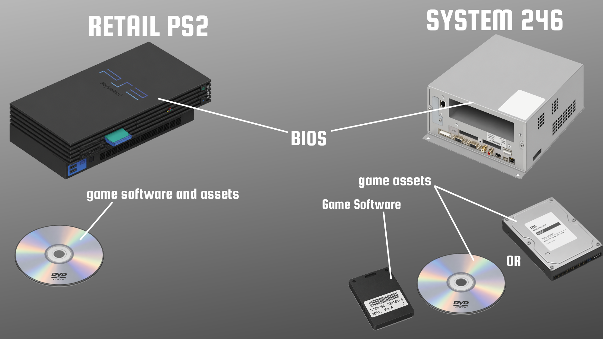

# How to dump games

The SYSTEM246 games, unlike retail PS2s, will have game data and software splitted in more than one storage device:

## Dump Dongle

### From a retail PS2
if you posses a jailbroken retail PS2, you may dump all your dongles into an USB thumb drive with [Memory Card Annihilator](https://github.com/ffgriever-pl/Memory-Card-Annihilator/releases)

### From a PC
If you posses a PS3 CECHZM1 Memory Card adapter, you may use [PS3MCA-TOOL](https://github.com/israpps/ps3mca_tool) to dump your dongles directly to your pc. **just make sure to use the `-imgecc` dump command!**

### From a System246

Unfortunately, due to design restrictions from the arcade Mechacon (security CPU) you won't be able to use your system246 to dump dongles.

> Arcade mechacon does not allow dongle swapping after boot. it gets "married" to the first authorized dongle
> and the second port only accepts licensed SCPH-10020 memory cards, so it won't read dongles either.

## Dump game Media
As shown on the image above, game media can be either CD, DVD or HardDrive

### Hard Drive
Just do a sector by sector dump. just like with Retail PS2 HDDs, we recommend [HDD RAW COPY TOOL](https://hddguru.com/software/HDD-Raw-Copy-Tool/)

### DVD / CD
Dump the disc into an ISO9660 image. Eventually, the emulator will support CHD just like "play!"

You may use the disc dumper of your preference... be it ultraiso, [PowerISO](https://www.poweriso.com/) or [ImgBurn](https://www.imgburn.com/). or whatever program you like and trust
